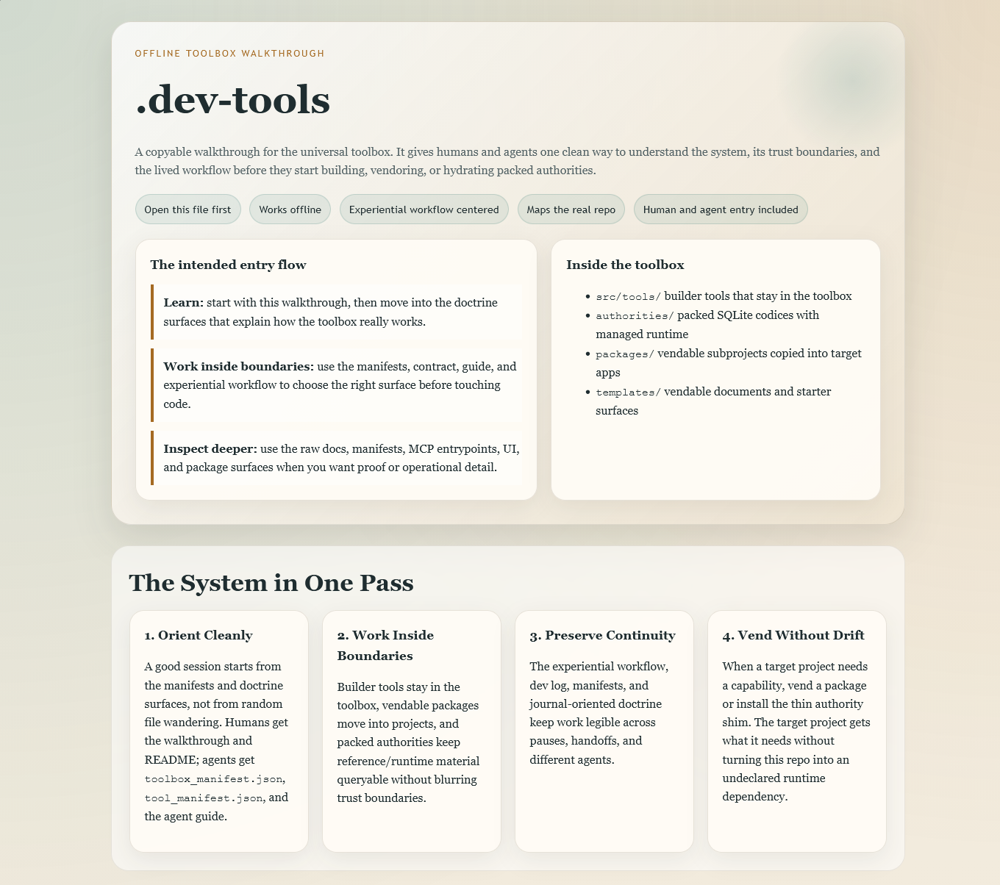
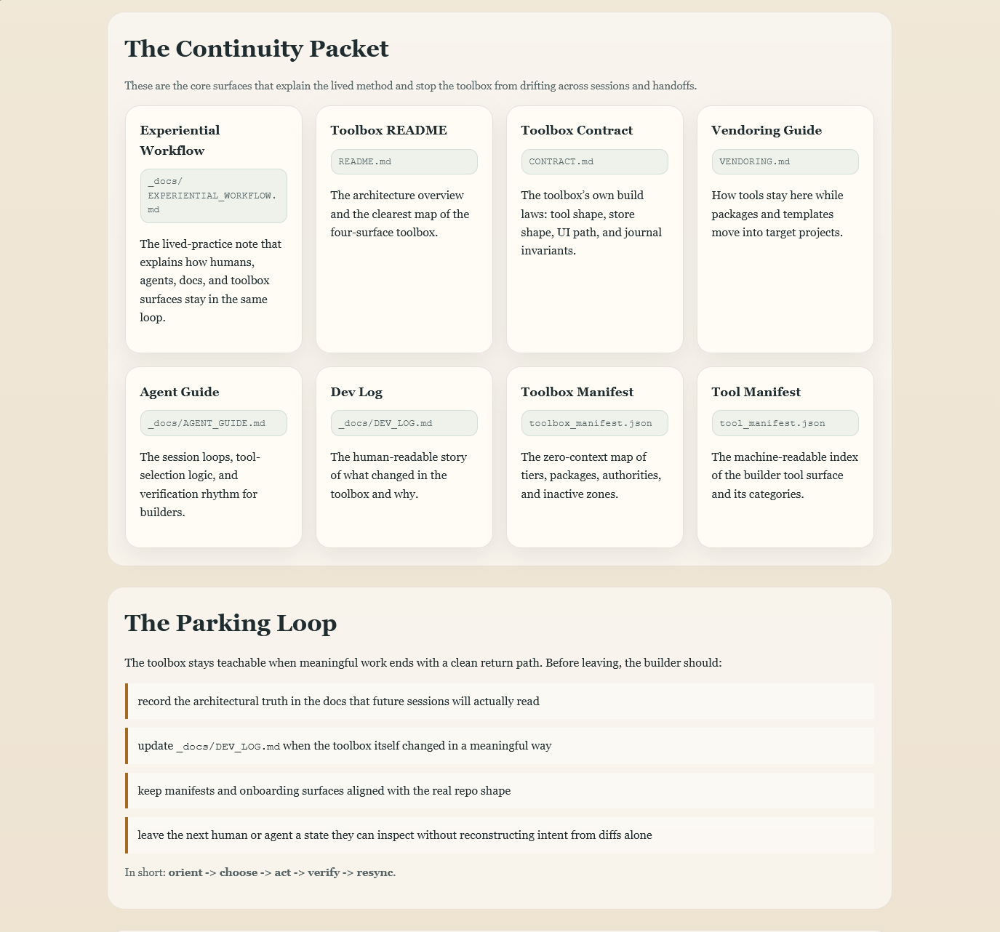

# .dev-tools — Universal Agent Toolbox

A project-agnostic toolbox designed to be vendored into any project for use by
human developers and AI agents. Contains builder tools for working ON projects,
vendable packages for installing INTO projects, and reusable document templates.

Everything here is portable, self-contained, and free of project-specific
coupling. If you move this folder, it still works.

---

## Start Here

If you want the friendliest onboarding path from a copied folder, open:

- `START_HERE.html`
- `OPEN_ME_FIRST.bat` (Windows)
- `OPEN_ME_FIRST.command` (macOS)

| If you are... | Read this first |
|---------------|-----------------|
| A human seeing this toolbox for the first time | `START_HERE.html` → then this file |
| An agent entering for the first time | `toolbox_manifest.json` → then `_docs/AGENT_GUIDE.md` |
| A human wanting the full picture | This file, then `CONTRACT.md` and `VENDORING.md` |
| An agent about to build a project | `_docs/AGENT_GUIDE.md` — workflow loops and tool selection |
| Looking to vend tools into a project | `VENDORING.md` — vendoring guide for the sidecar, packages, and templates |
| Wanting the lived workflow behind the mechanics | `_docs/EXPERIENTIAL_WORKFLOW.md` |
| Wanting the setup-first doctrine for new projects | `_docs/SETUP_DOCTRINE.md` |
| Wanting the tranche closeout and handoff regimen | `_docs/PARKING_WORKFLOW.md` |
| Wanting the remaining northstars and local-agent ops roadmap | `_docs/NORTHSTARS.md` |
| Looking for the dev history | `_docs/DEV_LOG.md` |

---

## Walkthrough Preview





---

## Three-Surface Architecture

### Tier 1: Builder Tools (`src/tools/`)

Analysis, patching, and audit tools that **stay in the toolbox**. Agents use
these to work ON target projects without modifying the toolbox itself.

| Tool | Category | Purpose |
|------|----------|---------|
| `journal_init` | bootstrap | Initialize a journal database |
| `journal_manifest` | introspection | Read tool/package manifests |
| `journal_write` | write | Write entries to the journal |
| `journal_query` | query | Query journal entries |
| `journal_export` | export | Export journal data |
| `journal_acknowledge` | contract | Acknowledge contract terms |
| `journal_actions` | ledger | Track action items |
| `journal_scaffold` | scaffold | Scaffold project layouts |
| `journal_pack` | packing | Pack journal into DB |
| `journal_snapshot` | snapshot | Snapshot journal state |
| `sidecar_install` | install | Install the full sidecar payload into a target project |
| `project_setup` | bootstrap | Audit, apply, and verify setup doctrine inside a target project |
| `onboarding_site_check` | testing | Verify the offline onboarding microsite and launch surfaces |
| `repo_search` | introspection | Search project text with an `rg` fast path and safe native fallback |
| `host_capability_probe` | introspection | Report local host, runtime, shell, Docker, kubectl, Node/npm, rg, and browser command availability |
| `workspace_boundary_audit` | introspection | Resolve project, sidecar, git, runtime, ignored-path, footprint, and write-boundary context |
| `project_command_profile` | introspection | Detect declared setup/test/run/build/dev commands and emit stable command IDs |
| `process_port_inspector` | introspection | Inspect relevant processes and occupied ports with platform-safe fallbacks |
| `dependency_env_check` | introspection | Check Python/Node dependency readiness without installing or mutating anything |
| `module_decomp_planner` | architecture | AST-based module decomposition planning |
| `tokenizing_patcher` | editing | Whitespace-immune hunk-based patching |
| `domain_boundary_audit` | analysis | Detect domain boundary violations |
| `scan_blocking_calls` | analysis | Scan for UI-blocking calls |
| `sqlite_schema_inspector` | introspection | Inspect SQLite schema, tables, indexes, sample rows |
| `import_graph_mapper` | analysis | Map Python import dependency graph with cycle detection |
| `tkinter_widget_tree` | analysis | Map Tkinter widget hierarchy, geometry, and bindings |
| `file_tree_snapshot` | introspection | Walk a project into structured JSON tree with sizes, line counts, and docstrings |
| `smoke_test_runner` | testing | Discover and execute all `smoke_test.py` files across the toolbox and packages |
| `python_complexity_scorer` | analysis | Score Python functions by cyclomatic complexity, nesting, and length |
| `dead_code_finder` | analysis | AST cross-reference of definitions vs usages to surface unused code |
| `test_scaffold_generator` | scaffold | Generate pytest/unittest stubs for every public function in a source file |
| `schema_diff_tool` | introspection | Compare two SQLite schemas — added/dropped tables, columns, indexes, FKs |

The single source of truth for the active tool set is `tool_manifest.json`
(currently 32 tools). Every tool follows the same contract: `FILE_METADATA` dict + `run(arguments)`
function + `standard_main()` CLI. See `CONTRACT.md` for the full mechanical
specification.

The next active capability horizon is local-agent system operations: safe
MCP-visible tools that let an agent inspect host capabilities, workspace
boundaries, declared project commands, processes/ports, dependency readiness,
dev servers, Docker/Kubernetes surfaces, secrets, runtime artifacts, and a
bootstrap packet without adding raw unrestricted terminal parity. See
`_docs/NORTHSTARS.md` for the phased closure plan.

### Tier 2: Vendable Packages (`packages/`)

Self-contained subprojects that get **installed into** target projects. Each
package has its own MCP server, CLI tools, smoke test, and documentation.

| Package | Purpose |
|---------|---------|
| `_app-journal/` | SQLite-backed shared journal with Tkinter UI and MCP access |
| `_manifold-mcp/` | Reversible text-evidence-hypergraph with evidence bags |
| `_ollama-prompt-lab/` | Local prompt evaluation and Ollama model comparison |
| `_constraint-registry/` | Atomic constraint registry for surgical rule injection into agent prompts |

See [`packages/README.md`](packages/README.md) for vendoring instructions.

### Tier 3: Vendable Documents (`templates/`)

Project-agnostic templates and reference docs that can be copied into any new
project as starting points.

| Template | Purpose |
|----------|---------|
| `_BuilderConstraintCONTRACT/` | The full Builder Constraint Contract — governance for agent-driven development |

See [`templates/README.md`](templates/README.md) for details.

---

## Agent Entry (Zero Context)

If you are an agent arriving with no prior context:

1. **Read `toolbox_manifest.json`** — it indexes the active surfaces and tells you
   what is available.
2. **Read `CONTRACT.md`** if you are about to build or modify a project — it
   defines the rules you operate under.
3. **Read `VENDORING.md`** if you need to install tools or packages into a
   target project.
4. **Choose** from builder tools or vendable packages based on your task.
5. **Open** the chosen area's `tool_manifest.json` and `README.md` for
   specifics.

---

## Human Entry

Double-click `run.bat` (Windows) or run `./run.sh` (Linux/macOS) to launch the
`.dev-tools` installer GUI. Pick the target project folder, then click Install.
If a `.dev-tools/` sidecar already exists at that target, the installer will ask
you to confirm a clean remove-and-reinstall, or cancel.

```powershell
run.bat          # Windows — launches the installer GUI
./run.sh         # Linux/macOS — launches the installer GUI
python install.py  # equivalent direct invocation
```

## MCP Server

```powershell
python src/mcp_server.py
```

Exposes all builder tools over MCP stdio transport.

## Self-Test

```powershell
python src/smoke_test.py
```

---

## Typical Workflow

1. **Install** the full sidecar into a target project:
   ```
   python install.py
   ```

2. **Install** the full sidecar from the CLI:
   ```
   python src/tools/sidecar_install.py run --input-json "{\"target_project_root\": \"C:\\path\\to\\project\"}"
   ```

3. **Audit or apply** project setup inside the target project:
   ```
   python .dev-tools/src/tools/project_setup.py run --input-json "{\"action\": \"audit\", \"project_root\": \".\"}"
   python .dev-tools/src/tools/project_setup.py run --input-json "{\"action\": \"apply\", \"project_root\": \".\", \"actor_id\": \"builder_agent\"}"
   ```

4. **Check** the installed onboarding microsite:
   ```
   python .dev-tools/src/tools/onboarding_site_check.py run --input-json "{\"toolbox_root\": \".dev-tools\"}"
   ```

5. **Vend a package** by copying from `packages/` into the target project:
   ```
   cp -r packages/_app-journal <target>/.dev-tools/_app-journal
   ```

6. **Vend templates** by copying from `templates/` as needed.

---

## Key Documents

| Document | What It Covers |
|----------|---------------|
| `CONTRACT.md` | Builder Constraint Contract — the governing discipline for agents |
| `VENDORING.md` | How to vend tools, packages, and templates into target projects |
| `release_payload_manifest.json` | Machine-readable inventory of what the full sidecar install currently ships |
| `toolbox_manifest.json` | Machine-readable index of all tiers and packages |
| `tool_manifest.json` | Machine-readable index of all builder tools |
| `_docs/EXPERIENTIAL_WORKFLOW.md` | Human-agent workflow rhythm and onboarding doctrine |
| `_docs/SETUP_DOCTRINE.md` | Project setup-first doctrine for freshly armed agents |
| `_docs/PARKING_WORKFLOW.md` | Practical tranche parking and handoff workflow |
| `_docs/NORTHSTARS.md` | Release closure and local-agent sys-ops roadmap |
| `_docs/DEV_LOG.md` | Development history and change log |
| `_docs/ARCHITECTURE.md` | Current sidecar architecture |
| `LICENSE.md` | Source-available reference license |

---

## License

Source-Available Reference License. You may read, study, and learn from this
code. Copying, distribution, and commercial use require written authorization.
See [`LICENSE.md`](LICENSE.md) for full terms.
